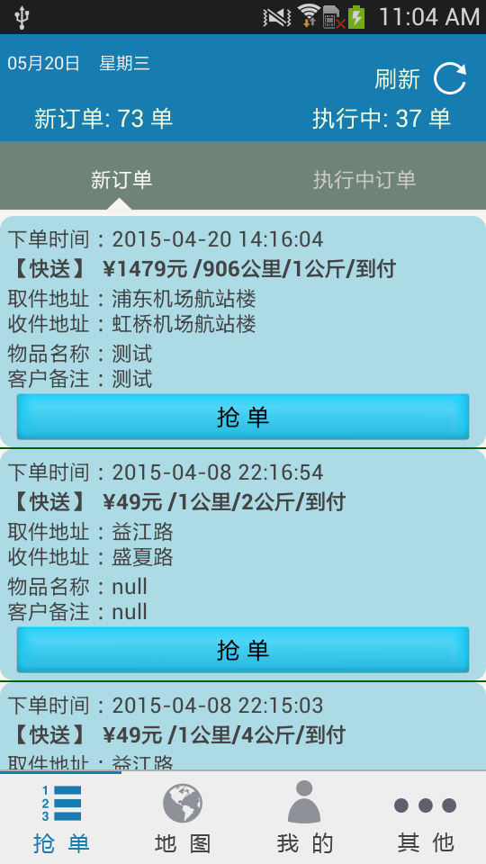
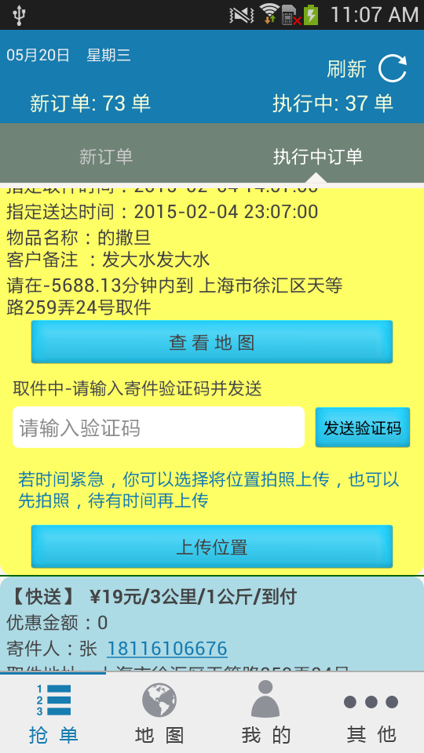
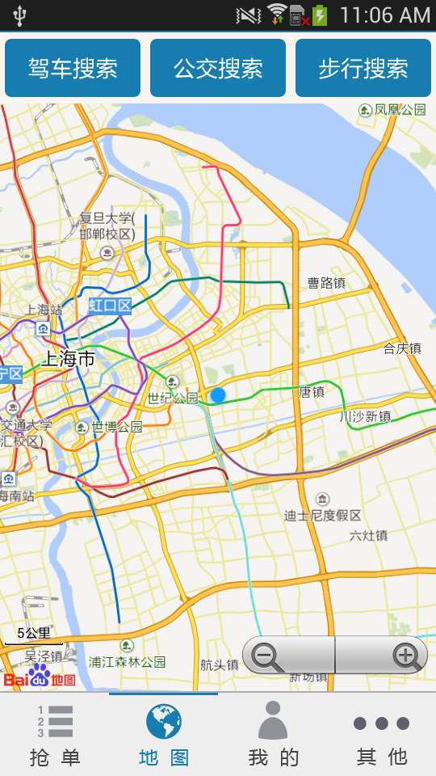
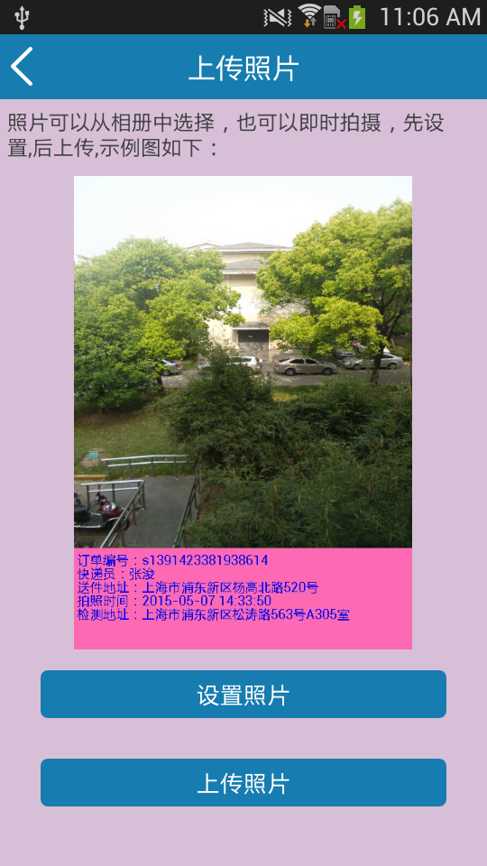
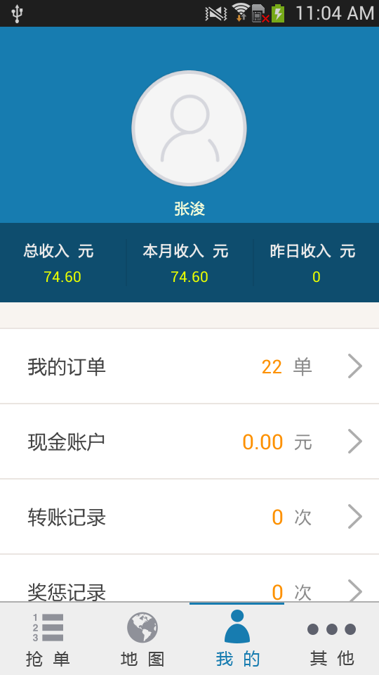
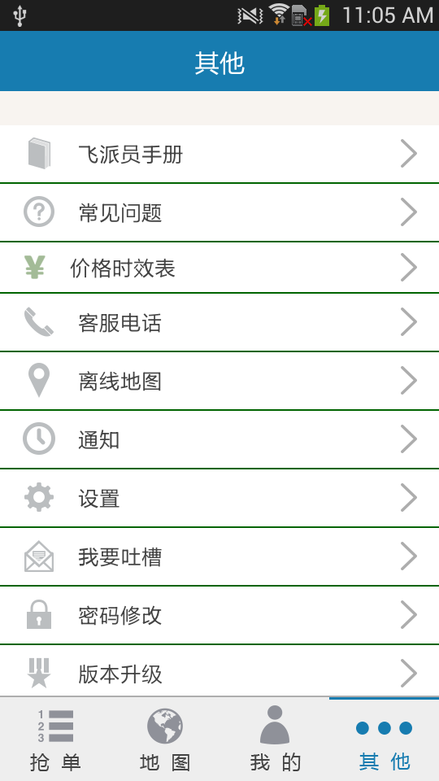

### Feipai
`feipai` android client 
this is `feipai` androdi client code,not include `setting` document,only a module

***
###screetshot as beblow
- home page 
　
　　
- invoke baidu map page. 
 
- location page .
   
- my and other page 
  
　　
